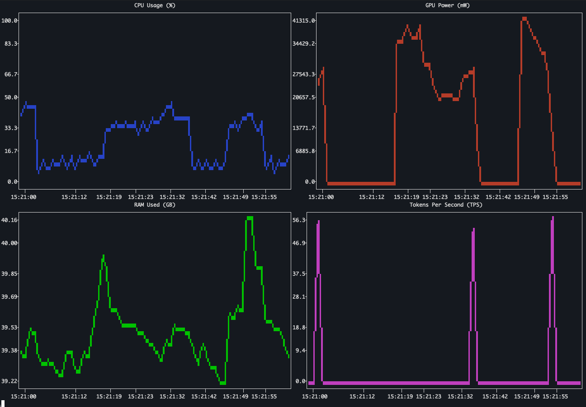

# Ollama Benchmark Monitor

A set of handy shell scripts to benchmark and continuously monitor Ollama models performance and system resource utilization on macOS.

## Description

This repository provides tools to track hardware usage (CPU, GPU, RAM) and tokens-per-second (TPS) while running Ollama on macOS. It includes:
- **Benchmark Monitor:** Executes a single prompt and measures performance metrics.
- **Continuous Monitor:** Runs in the background as a daemon to continuously log system metrics and inference speeds.

### Interactive Dashboard

To view a real-time TUI (Text User Interface) plotting the continuous metrics in your terminal (requires the continuous monitor to be running):
```shell
make dashboard
```


*Example run of Mixtral 8x7B on an M4 Max with 64GB RAM during regular office load.*


## Usage

### 1. Benchmark Testing

To run the benchmark, execute the script from your terminal with a run type argument.

```shell
./src/bench_monitor.sh [clean|dirty]
```
-   `clean`: Intended for a run on a system with minimal background processes.
-   `dirty`: Intended for a run under normal system load.

The script requires `sudo` privileges to access `powermetrics` for GPU statistics.

### 2. Continuous Monitoring

To start the continuous monitoring daemon in the background:
```shell
make monitor-start
```
*Note: This will prompt for your `sudo` password to access GPU metrics.*

To stop the continuous monitor:
```shell
make monitor-stop
```

### 3. TPS Proxy (Zero-Configuration and safe rollback)

To capture Tokens-Per-Second (TPS) for background API inference, you can start the thin TPS proxy. This will automatically reconfigure your actual Ollama server to run on a background port (`11435`) and place the proxy on the default port (`11434`), allowing your existing client tools to work with zero configuration changes.

> **⚠️ Important Notice Regarding Live TPS Updates:**
> Ollama's API streams generated text continuously, but it **only emits performance statistics (`eval_count` and `eval_duration`) in the very last JSON chunk** when the generation is completely finished.
> Because of this architectural design, the proxy cannot calculate a "live" TPS. The TPS value in the monitor will remain `0` while the model is loading and generating text. You will only see the TPS spike logged at the exact moment the generation finishes.
>
> **Note on Large Models:** If you are running massive models (e.g., a 22B parameter model like Mixtral on a laptop) that spill into system RAM and generate text extremely slowly (e.g., 1 word per minute), you will not see *any* TPS reading until all requested words have finally finished generating, which could take a very long time.

To start the proxy:
```shell
make tps-proxy-start
```
*Note: On Linux, this will require `sudo` to configure systemd.*

To stop the proxy and restore Ollama to its default configuration:
```shell
make tps-proxy-stop
```


## 4. Configuration

When ran in script mode, it is configured via variables at the top of the file.

-   `MODEL`: The Ollama model tag to benchmark (e.g., `qwen3-coder:30b`).
-   `PROMPT`: The input prompt for the model. As a shortcut, this is a hard-coded zero-shot prompt. For more advanced use cases, this can be externalized to be read from a file or command-line argument.
-   `OUTPUT_DIR`: The directory where benchmark reports and logs are stored.

## Output

The script generates the following files in the specified `OUTPUT_DIR`:

-   **Markdown Report** (`benchmark_report_[type]_[timestamp].md`): A detailed report containing performance metrics, system resource usage summaries, and the full model output.
-   **System Metrics CSV** (`system_metrics_[type]_[timestamp].csv`): Raw time-series data of CPU, GPU, and RAM usage during the run.
-   **Summary CSV** (`benchmark_summary.csv`): A log file that appends a summary of each benchmark run, including performance and configuration details.


## AI Co-Development Guidelines
This project supports AI-assisted development. Please refer to [AI.md](AI.md) for guidelines on how AI agents should interact with this repository (Issue-driven development, PR workflows, and CI/CD).

